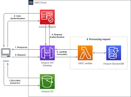

# AWS Lambda Powered Portal

Welcome to the AWS Lambda Powered Portal repository! This project demonstrates a serverless application deployed on AWS Lambda. The application serves as a portal for managing user accounts and accessing various services.

## Architecture Overview

The architecture of this serverless application is based on AWS Lambda, API Gateway, DynamoDB, and S3. Below is a high-level overview:



## Prerequisites

Before you begin, ensure you have met the following requirements:

- AWS account with appropriate permissions
- AWS CLI installed and configured
- Serverless Framework installed (`npm install -g serverless`)

## Getting Started

To get a local copy up and running, follow these simple steps:

1. Clone the repository:
   ```sh
   git clone https://github.com/h1102sh-Developer/AWS-Lambda-Powered-Portal.git
